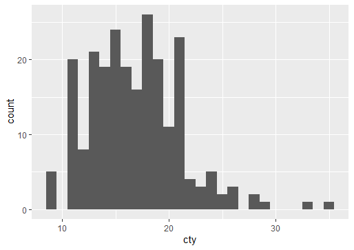
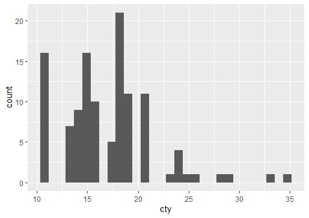
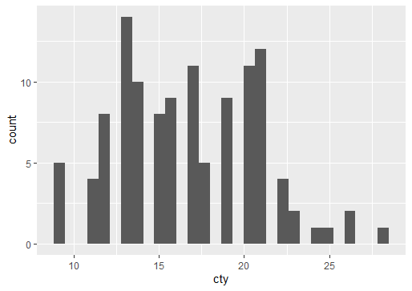
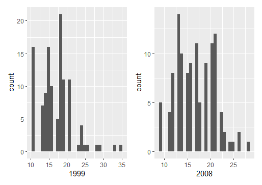
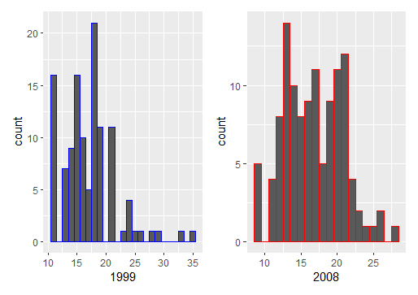

```{r setup, include=FALSE}
knitr::opts_chunk$set(echo = FALSE)
```

# Olá! Agora vamos trabalhar com alguns gráficos para análisar nossos dados

[Neste post](https://gbastosg.github.io/guilhermesportfolio/posts/2022-04-20-combinando-as-ferramentas-do-tidyverse/) fizemos algumas manipulações para formar grupos e entender os dados. Hoje faremos alguns gráficos para ajudar na interpretação.

Continuaremos usando os dados `mpg` (miles per gallon) incluso no pacote ggplot, por isso vamos carregar o tidyverse:

```
library(tidyverse)
```

Para compreender mais sobre os dados, clique no link do post anterior

# Será que os motores ficaram mais eficientes ao longo do tempo?

Para responder essa pergunta, podemos plotar a eficiencia dos motores (aqui medida pelo gasto de galões por milhas percorridas), para plotar usamos as funções embutidas no pacote `ggplot2`.

# Histogramas

Histogramas são também conhecidos como gráficos de frequência e nos mostram quantas vezes um valor aparece em nosso data set:

```
mpg %>%
  ggplot(aes(x = cty)) +
  geom_histogram(binwidth = 1)
```



Perceba que no eixo Y está a contagem de quantas vezes aquele valor aparece, enquanto no eixo X podemos ver os valores de `cty` (a quantidade de milhas que um carro percorre por galão de combustível)

Podemos contruir outros histogramas e compará-los:

```
mpg %>%
  filter(year == 1999) %>%
  ggplot(aes(x = cty)) +
  geom_histogram()
```


```
mpg %>%
  filter(year == 2008) %>%
  ggplot(aes(x = cty)) +
  geom_histogram()
```


Agora podemos usar o pacote `Patchwork` para visualizar os dois gráficos no mesmo quadro:

```
library(patchwork)

hist1999 <- mpg %>%
  filter(year == 1999) %>%
  ggplot(aes(x = cty)) +
  geom_histogram() +
  xlab("1999")
  
hist2008 <- mpg %>%
  filter(year == 2008) %>%
  ggplot(aes(x = cty)) +
  geom_histogram() +
  xlab("2008")
  
hist1999  + hist2008
```


Interessante, não?

Podemos também mudar a cor dos nossos plots para melhorar a comparação:

```

hist1999 <- mpg %>%
  filter(year == 1999) %>%
  ggplot(aes(x = cty)) +
  geom_histogram(color = "Blue", binwidth = 1) +
  xlab("1999")
  
hist2008 <- mpg %>%
  filter(year == 2008) %>%
  ggplot(aes(x = cty)) +
  geom_histogram(color = "Red", binwidth = 1) +
  xlab("2008")
  
hist1999  + hist2008
```



Observando dessa maneira parece até fácil concluir que os carros se tornaram mais eficientes ao longo dos anos.
